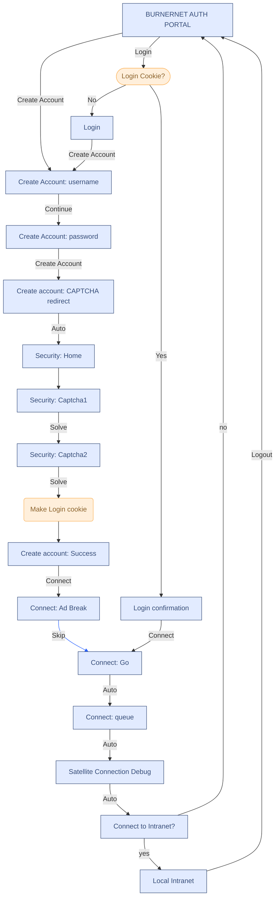

```mermaid
---
config:
  layout: dagre
---
flowchart TB
    n1["BURNERNET AUTH PORTAL"] -- Create Account --> n2["Create Account: username"]
    n1 -- Login --> n3(["Login Cookie?"])
    n3 -- No --> n4["Login"]
    n3 -- Yes --> n5["Login confirmation"]
    n2 -- Continue --> n6["Create Account: password"]
    n4 -- Create Account --> n2
    n6 -- Create Account --> n7["Create account: CAPTCHA redirect"]
    n8["Security: Captcha1"] -- Solve --> n9["Security: Captcha2"]
    n10["Create account: Success"] -- Connect --> n11["Connect: Ad Break"]
    n11 -- Skip --> n17["Connect: Go"]
    n5 -- Connect --> n17
    n23["Connect to Intranet?"] -- yes --> n24["Local Intranet"]
    n23 -- no --> n1
    n9 -- Solve --> n25["Make Login cookie"]
    n25 --> n10
    n7 -- Auto --> n26["Security: Home"]
    n26 --> n8
    n17 -- Auto --> n27["Connect: queue"]
    n27 -- Auto --> n18["Satellite Connection Debug"]
    n18 -- Auto --> n23
    n24 -- Logout --> n1

    n1@{ shape: rect}
    n2@{ shape: rect}
    n4@{ shape: rect}
    n5@{ shape: rect}
    n6@{ shape: rect}
    n7@{ shape: rect}
    n8@{ shape: rect}
    n9@{ shape: rect}
    n10@{ shape: rect}
    n11@{ shape: rect}
    n25@{ shape: rounded}
     n1:::Sky
     n2:::Sky
     n3:::Peach
     n4:::Sky
     n5:::Sky
     n6:::Sky
     n7:::Sky
     n8:::Sky
     n9:::Sky
     n10:::Sky
     n11:::Sky
     n17:::Sky
     n23:::Sky
     n24:::Sky
     n25:::Peach
     n26:::Sky
     n27:::Sky
     n18:::Sky
    classDef Rose stroke-width:1px, stroke-dasharray:none, stroke:#FF5978, fill:#FFDFE5, color:#8E2236
    classDef Peach stroke-width:1px, stroke-dasharray:none, stroke:#FBB35A, fill:#FFEFDB, color:#8F632D
    classDef Sky stroke-width:1px, stroke-dasharray:none, stroke:#374D7C, fill:#E2EBFF, color:#374D7C
    click n1 "/index.html"
    click n2 "/create-account/start.html"
    click n4 "/login.html"
    click n5 "/login-success.html"
    click n6 "/create-account/set-password.html"
    click n7 "/create-account/error.html"
    click n8 "/verify/captcha.html"
    click n9 "/verify/captcha.html"
    click n10 "/create-account/success.html"
    click n11 "/connect/ad-break.html"
    click n17 "/connect/go.html"
    click n23 "/connect/error666.html"
    click n24 "/intranet/home.html"
    click n26 "/verify/home.html"
    click n27 "/connect/queue.html"
    click n18 "/connect/geolocate.html"
    linkStyle 9 stroke:#2962FF,fill:none
```